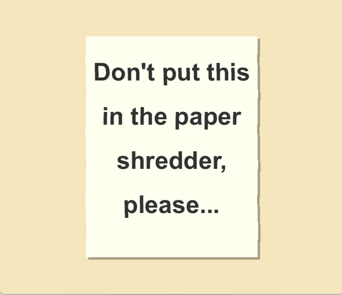
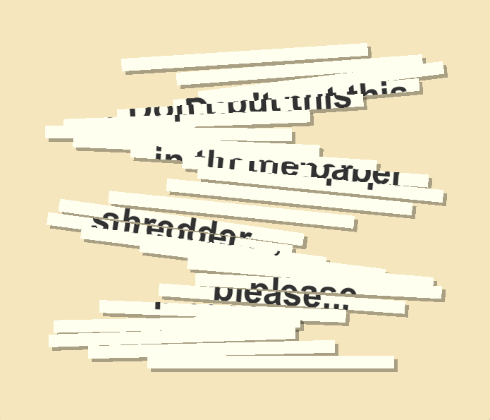
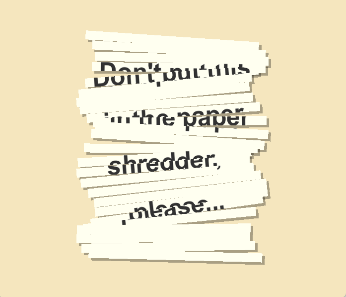

# Projet Libre

## Don't put this in the paper shredder, please...

### Description du projet

L'idée globale du projet : Créer des affiches portant un message contradictoire à leur état.

En l'occurrence, ici, je présente une affiche portant le message : " Don't put this in the paper shredder, please" alors que l'affiche est découpée comme si on venait de l'insérer dans la machine.

J'étais un peu déçue de mon projet précédent portant sur le thème de la poésie numérique (je trouvais qu'il ne donnait pas assez d'importance aux mots). Alors, j'ai décidé de faire une affiche qui montrait un lien direct entre son message littéral et son interprétation.

### Screenshots

J'aurais aimé en faire une série, mais le temps ne me le permettait pas. Je pense développer cette idée au cours de l'année !
